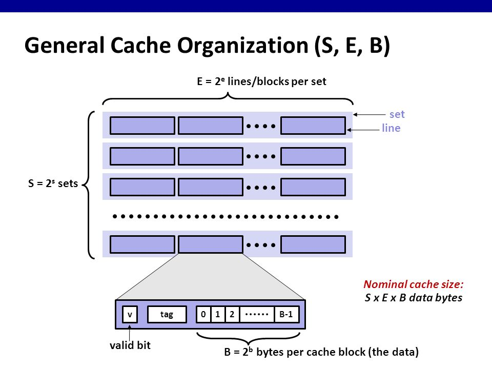
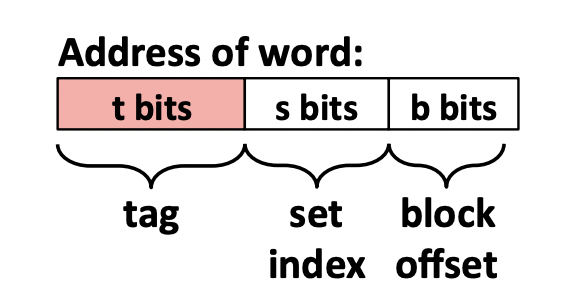

# LRU Cache simulator

#### Table of contents

  - [Introduction](#introduction)
  - [Cache Design](#cache-design)
  - [How the cache works](#how-the-cache-works)
    - [Set selection](#set-selection)
    - [Line matching](#line-matching)
    - [Line Replacement Policy on Misses](#line-replacement-policy-on-misses)
  - [How the cache simulator works](#how-the-cache-simulator-works)
  - [Usage](#usage)

## Introduction

This is a small C program that simulates the behavior of a cache memory.

## Cache Design



Suppose we are on a computer system whose memory address has m bits. As the image above illustrates, a cache is organized as an array of *S* sets. Each set contains *E* cache lines. Each line consists of a valid bit that indicates whether or not the line contains meaningful information, *t = m - (b + s)* tag bits that uniquely identify the block stored in the cache line, and a data block of *B* bytes. So, where do *s* and *b* come?



For the computer system to know which sets and lines to read from, the cache views each *m* bits memory as the image above. There will be *b* bits to indicate where our data starts in the data block of the cache line. The next *s* bits represent the index of the set in the array of *S* sets. The *t = m - (b + s)* bits indicate a tag associated with the address.

When the CPU is instructed by a load instruction to read a word from address *A* of main memory, it sends address *A* to the cache. The cache then parses the address *A* as we discussed above. A line in the set contains the word if and only if the valid bit is set and the tag bits in the line match the tag bits in the address *A*.

## How the cache works

Suppose we have a system with a CPU, a register file, an L1 cache, and a main memory. When the CPU executes an instruction that reads memory word *w*, it requests the word from the L1 cache. If the L1 cache has a cached copy of *w*, then we have an L1 cache hit, and the cache quickly extracts *w* and returns it to the CPU. Otherwise, we have a cache miss, and the CPU must wait while the L1 cache requests a copy of the block containing *w* from the main memory. When the requested block finally arrives from memory, the L1 cache stores the block in one of its cache lines, extracts word *w* from the stored block, and returns it to the CPU. There are three steps that a cache goes through to determine whether a request is a hit or a miss: **(1) set selection**, **(2) line matching**, and **(3) word extraction**.

These processes may vary with different types of caches: direct-mapped cache, set-associative cache, and fully-associative cache, but the general idea is still the same. Below is the description of how to access a word by a memory address.

### Set selection

In this step, the cache extracts the *s* set index bits from the middle of the address for *w*. These bits are interpreted as an unsigned integer that corresponds to the index of the set in the cache of *S* sets.

### Line matching

Once the cache goes into a specific set, it searches each line in that set for a valid line whose tag matches the tag in the address. If the cache finds such a line, then we have a hit. If the valid bit is not set or the tag does not match, then we will have a cache miss.

### Line Replacement Policy on Misses

In this program, I chose to use least recently used (LRU) policy to perform line replacement when we have a cache miss. LRU policy, which will replace the line that was last accessed the furthest in the past, can take advantage of temporal locality, which boosts the program's performance.

## How the cache simulator works

The `traces` subdirectory contains a collection of reference trace files that will be used to evaluate the correctness of the cache simulator. The format of each line in the trace file is `[space]operation address, size`. The operation field denotes the type of memory address: "I" denotes an instruction load, "L" a data load, "S" a data store, and "M" a data modification (a data load followed by a data store). The address field specifies a 64-bit hexadecimal memory address. The size field specifies the number of bytes accessed by the operation.

The program will print out the number of cache hits, misses, and evictions (replacements when a cache miss happens). Since we only care about the performance of the cache with the LRU replacement policy, we do not actually store any data but only count the number of cache hits, misses, and evictions.

## Usage

1. Clone this repo
2. `cd` into the repo, and then use the command `make`
3. Run the executable `csim` file as follows
```
Usage: ./csim [-hv] -s <s> -E <E> -b <b> -t <tracefile>
```

- `-h`: Optional help flag that prints usage info

- `-v`: Optional verbose flag that displays trace info

- `-s <s>`: Number of set index bits (S = 2^s is the number of sets)

- `-E <E>`: Associativity (number of lines per set)

- `-b <b>`: Number of block bits (B = 2^b is the block size)

- `-t <tracefile>`: Name of the trace file.

Example:
```
linux> ./csim -s 4 -E 1 -b 4 -t traces/yi.trace 
hits:4 misses:5 evictions:3
```

Example in verbose mode:
```
linux> ./csim -v -s 4 -E 1 -b 4 -t traces/yi.trace
L 10,1 miss
M 20,1 miss hit
L 22,1 hit
S 18,1 hit
L 110,1 miss eviction
L 210,1 miss eviction
M 12,1 miss eviction hit
hits:4 misses:5 evictions:3
```